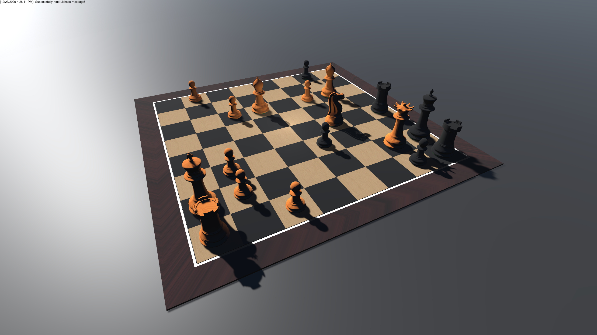

# lichess3d
lichess3d Copyright (C) 2020 Jeremy Collette.

lichess3d is a 3D chess client for Lichess created in Unity.

**NOTE: Please note this project is still in alpha phase. Some features may be incomplete and/or may not meet quality standards. Show your support by reporting and/or fixing bugs.**

# License
lichess3d is released as free software under the GPLv3 license. Please note that there may be some conditions that apply to the free use and distribution of this software. Please see the LICENSE file for more information.

# Running
To play, simply download a Release from the side of the page and run it!

# Building
To build lichess3d locally, there are a few simple steps.

1. Acquire (free) licenses for the required build-time dependencies from the Unity Asset Store:
   * [3D Wooden Chess Set - v1.0](https://assetstore.unity.com/packages/3d/props/3d-wooden-chess-set-183336)
   * [JSON .NET For Unity - v2.0.1](https://assetstore.unity.com/packages/tools/input-management/json-net-for-unity-11347)

2. Clone the lichess3d repository, and open it in Unity.

3. Open the "Package Manager" in Unity, and install the specified version of the Assets mentioned above.

4. Open the "Chessboard" Scene and hit the play button!

Please note that when lichess3d is built, the resulting binary is covered by the lichess3d license mentioned above. However, the Assets mentioned here have their own licensing terms, and in their standalone form (i.e. not part of a binary) they are not covered by the lichess3d license. Please refer to the Unity Asset Store page for each Asset to find their licensing terms.
